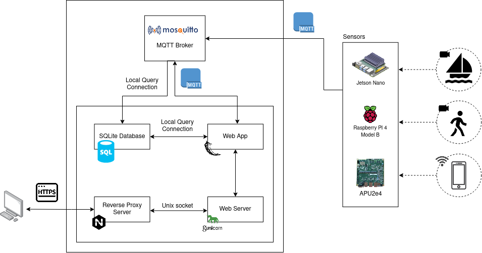

## Architecture diagram

The data relative to the number of people detected by Wi-Fi sniffing and object detection and the number of moliceiros detected by object detection is captured by the respective modules in the sensors and this data is sent to the broker through a MQTT connection. The broker saves the data in a database and also sends it to the Web service (Flask). The web server (Gunicorn) interacts with the Web service and communicates with the Reverse Proxy Server (Nginx) through a Unix socket. The Reverse Proxy Server manages the load balance of requests. The user visualizes the web application in his device, sending and receiving HTTPS requests and responses.

