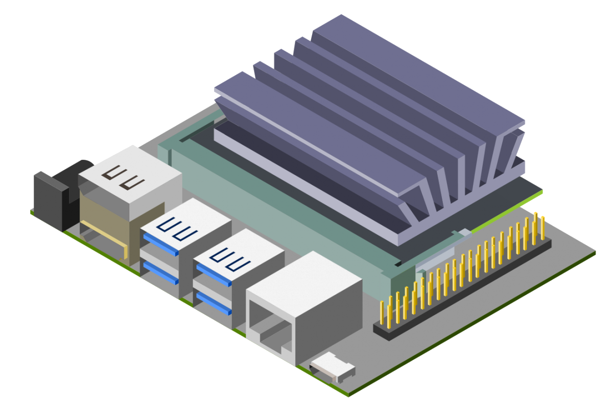
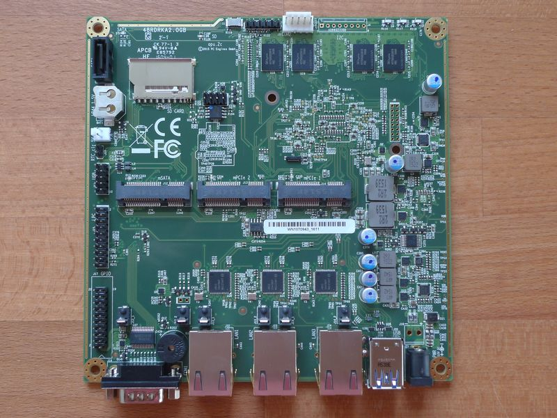
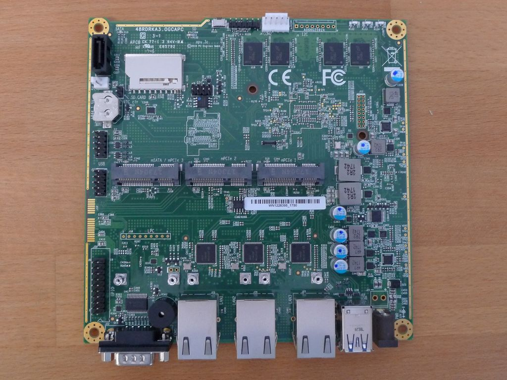

## Jetson Nano

The object detection script runs on a Jetson Nano located at IT. Jetson Nano is a small and powerful computer for embedded applications that allows to run multiple neural networks. Due to its capacities, this device supports our object detection module.

<div style="display: block;margin-left: auto;margin-right: auto;width:400px"></div>


### Local broker

During the detection in the video stream the number of detected objects is sent to a local broker in 6 different topics, which then sends these values to the central broker in IT.

```python
broker_address = "####.nap.av.it.pt"
port = 1883

#current
currentppl_topic = "detection/people/current"
currentvehicles_topic = "detection/vehicle/current"
currenttwowheelers_topic = "detection/twowheelers/current"

#unique
uniqueppl_topic = "detection/people/unique"
uniquevehicles_topic = "detection/vehicle/unique"
uniquetwowheelers_topic = "detection/twowheelers/unique"
```


## APU

The sniffing script runs on two different APUs. One is located in a smart lamp post near the IT building and another is located in a smart lamp post in Cais da Fonte Nova.

<div style="display: block;margin-left: auto;margin-right: auto;width:400px"></div>

### Local broker

During the detection of MAC address the number of devices is sent to a local broker in 2 different topics, which then sends these values to the central broker in IT.

```python
broker_address = "####.nap.av.it.pt"
port = 1883
currentppl_topic = "sniffing/current"
uniqueppl_topic = "sniffing/unique"
```

 <!-- ## RSU

To be updated

<div style="display: block;margin-left: auto;margin-right: auto;width:500px"></div> -->


## Services

The detection running on the devices are started after the Linux kernel is booted using services units and ```systemd``` to manage them. The units are located in the folder ```/etc/systemd/system```.

### APUs

```
[Unit]
Description=Wifi Sniffing Service
After=multi-user.target

[Service]
WorkingDirectory=/root/WiFi_Sniffing
User=root
Type=idle
ExecStart=/root/WiFi_Sniffing/venv/bin/python3 /root/WiFi_Sniffing/pyshark_ps.py wlan1
Restart=always

[Install]
WantedBy=multi-user.target
```

### Jetson Nano

```
[Unit]
Description=People Detection Service

[Service]
User=root
Type=forking
#WorkingDirectory=/usr/local/bin
ExecStart=/bin/bash /usr/local/bin/runDetection.sh
Restart=always

[Install]
WantedBy=multi-user.target
```

### References


[Jetson Nano information](https://www.nvidia.com/en-us/autonomous-machines/embedded-systems/jetson-nano/)

[APU information](https://www.pcengines.ch/apu2e4.htm)

<!-- [RSU information](https://pcengines.ch/apu3d4.htm) -->
