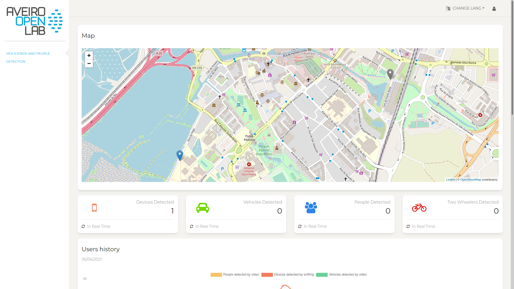

## Introduction 
Our Web Application includes one main page (which is also the home page), one page only for signed in accounts, one page for administrators only and one page to log in/sign in.

## Home Page

Our Home page is also our main page (Fig. 1).

 Fig. 1

#### Map

This map shows the city of Aveiro (Fig. 2). By pressing the pin points we can change the shown data for the data of the location of the pin point we choose.

 Fig. 2

#### Card - Devices Detected

In this card you can see the number of devices detected in real time.

  Fig. 3

#### Card - Vehicles Detected

In this card you can see the number of vehicles detected in real time.

  Fig. 4

#### Card - People Detected

In this card you can see the number of people detected in real time.

 Fig. 5

#### Card - Two Wheelers Detected

In this card you can see the number of two wheelers detected in real time.

 Fig. 6

#### Users History

In this graphic (Fig. 7) you can see the number of people detected by video, devices detected by sniffing and vehicles detected by video in the last 24 hours. If you hover the cursor on top a point it will show the numbers of that point in specific.

Fig. 7

#### People Detection

In this graphic (Fig. 8) you can see the number of people detected by video and devices detected by sniffing in the last 10 seconds.

Fig. 8

#### Users history - Into detail

Here the user can prompt the start and end date as well as the start and end time and a graphic showing the data for the specified time will appear (Fig. 9).

Fig. 9

#### Change Lang

By pressing this dropdown button the user can change the language of the Web Application to portuguese (pt) or english (en).

 Fig. 10

#### Log In

By pressing this button the user will be sent to the Log In page

 Fig. 11

## Log In / Sign Up

In this page the user may log in to their account (Fig. 12). If they do not have one they can create one if they have the authentication code. This authentication code purpose is to only allow authorized people to create accounts. To do this they should press the "Sign Up" button on the top right corner and fill their information (Fig. 13). 

 Fig. 12

 

 Fig. 13

## Authenticated Users

Authenticated Users have access to two special features such as notifications and moliceiros information.

#### Notifications

When users log in there will be a welcome notification. There will also be a notification if a service is down specifying the service (object detection or sniffing) as well as the location and time of this malfunction. (Fig. 13 & Fig. 14)

  Fig. 14 

  Fig. 15 

 
Besides appearing the notifications will also be saved in the bell icon. If the bell has a little circle it means that there are unread notifications. To clear the notifications saved in the bell as well as the ones appearing the user may click the button 'clear all' that appears after clicking the bell icon.

## Moliceiros Information

This authenticated users only page displays information about moliceiros.

  Fig. 15 

#### Cards

The cards are separated by companies and each card shows a certain moliceiro data. The data shown is the number of devices detected by sniffing in real time.

  Fig. 16 

## Administrators

Administrators are special authenticated users. Besides the normal features that an authenticated user has access to they also have access to a 'manage accounts' page.

## Manage Accounts

This page allows the administrators to revoke admins, make admins, remove authenticated users and validate accounts (Fig. 17). On the top of the page are the Administrators accounts with their name and email, as well as button to 'revoke admin' (Fig. 18). On the middle of the page the Administrators can see the normal authenticated users, their name and email. Each user also has two options on their card which are 'remove' and 'make admin' (Fig. 19). The account validation is on the bottom part of the page and is another safety measure (Fig. 20). 

  Fig. 17 

 

  Fig. 18 

 

  Fig. 19 

 

  Fig. 20 

 
